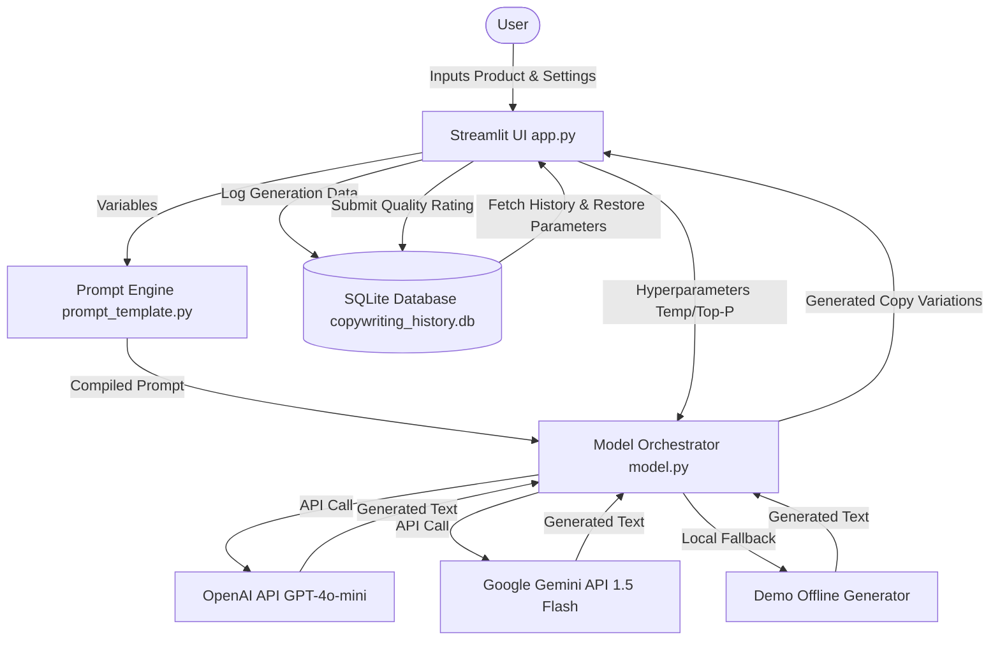

# ai-copywriting-tone-transformer
GenAI app that generates platform-specific marketing copy using dynamic prompts, tone control, and OpenAI text generation.
# Automated Copywriting & Tone Transformer 🤖⚡

An AI-powered copywriting application designed to take raw product descriptions and instantly convert them into high-converting, platform-specific marketing copy (LinkedIn, Instagram, Email) optimized for different brand tones and styles. 

Built using **Streamlit**, **OpenAI API**, and **Google Gemini API**, with a dynamic SQLite history store, prompt versioning, and real-time validation constraints.

---

## 🌟 Key Features

- **Dynamic Prompt Compilation**: Reusable and platform-specific prompt templates that dynamically inject product parameters.
- **Prompt Versioning**: Choose between different copywriting strategies:
  - `v1.0 (Standard)`: Conversational, friendly, and readable.
  - `v2.0 (Conversion Focused)`: Structured using copywriting frameworks like PAS (Problem-Agitate-Solve) or value-stacks to optimize CTA clicks.
  - `v3.0 (Storytelling)`: Narrative hooks that connect emotionally before presenting the product.
- **Multi-Model Integrations**: Call **OpenAI (GPT-4o-mini, GPT-4o)** or **Google Gemini (Gemini 1.5 Flash/Pro)** APIs.
- **Offline Demo Mode**: Run the app locally without any API key! Includes a rich rule-based text generation system for offline testing.
- **Multi-Variation Generation**: Generate up to 5 diverse copywriting variations in a single run.
- **Word & Character Metrics**: Live character validation checks that verify compliance with platform limits (e.g., warning if Instagram caption > 2,200 chars or LinkedIn > 3,000 chars).
- **SQLite History Logging**: Automatically save generations, parameters, prompts, and output.
- **Feedback & Rating**: Rate each generated copy out of 10 stars, writing back to the SQLite store.
- **Interactive Restore Settings**: Retrieve past generations from history and reload all parameters (Product Name, Tone, Platform, Temp, Top_P, Version) back into the active inputs with a single click.

---

## 🏗️ System Architecture



---

## 🛠️ Tech Stack

- **Frontend**: Streamlit (Python Web Application framework) with custom CSS dark-mode styling.
- **AI Models**: OpenAI (GPT-4o/GPT-4o-mini), Google Gemini API (gemini-1.5-flash).
- **Database**: SQLite (local serverless SQL storage).
- **Environment**: Python 3.10+.

---

## 🚀 Installation & Setup

Follow these steps to run the application locally on your machine:

### 1. Clone or Move to the Directory
Ensure you are inside the `copywriting-transformer` project directory:
```bash
cd copywriting-transformer
```

### 2. Install Dependencies
Install all required libraries using `pip`:
```bash
pip install -r requirements.txt
```

### 3. Configure API Credentials
Create a `.env` file in the root of the project directory (a template is provided in the repository) and enter your API keys:
```env
OPENAI_API_KEY=your_openai_api_key_here
GEMINI_API_KEY=your_gemini_api_key_here
```
*Note: If you do not have API keys, you can select "Demo (Offline)" mode inside the application sidebar to test the generation features.*

### 4. Launch the Web App
Run the Streamlit server:
```bash
streamlit run app.py
```

Streamlit will boot up the development server and open a new browser window automatically (usually at `http://localhost:8501`).

---

## 📖 Usage Instructions

1. **Configure Model**: Select your AI Provider (OpenAI, Gemini, or Demo Mode) in the sidebar. Enter keys if not loaded from `.env`.
2. **Adjust Creativity**: Drag the **Temperature** and **Top P** sliders.
3. **Fill Details**:
   - Give your brand/product a name.
   - Select the target platform (LinkedIn, Instagram, or Email).
   - Select the brand tone (Creative, Professional, Luxury, etc.).
   - Select a prompt template version. Check the dynamic description card explaining what that prompt layout focuses on.
   - Describe the product in the text area.
4. **Generate**: Click **Generate Marketing Copy**. Review variations in the tabbed panels.
5. **Rate & Record**: Rate variations using the rating slider and save the score. Use the **Copy** button in the upper-right corner of the code output box to copy it to clipboard.
6. **Browse History**: Expand the **SQLite Copywriting History Logs** section at the bottom to view older runs, filter by platform or tone, and reload past inputs.

---

## 📝 Example Output

### Inputs:
- **Product Name**: `EcoSIP`
- **Platform**: `Instagram`
- **Tone**: `Friendly`
- **Prompt Version**: `v2.0 (Conversion Focused)`
- **Description**: `Reusable glass straw with a silicone protective case and cleaning brush. Perfect for zero-waste travel.`

### Generated Caption (Variation 1):
```markdown
📸 [DEMO OFFLINE GENERATION]

STOP using single-use plastic straws! 🚫 Meet EcoSIP—the ultimate zero-waste travel companion.

Here is why you will love it:
✔️ Reusable tempered glass design (tastes better!)
✔️ Protective food-grade silicone carrying case
✔️ Custom cleaning brush included for easy maintenance

---

## 🔮 Future Improvements

1. **A/B Testing Simulator**: Evaluate output variations using standard readability formulas (Flesch-Kincaid, Gunning fog) to predict performance.
2. **Custom Prompt Upload**: Allow users to write and save their own copywriting frameworks to the database.
3. **Multi-Language Support**: Automatically translate outputs into Spanish, German, French, etc.
4. **Image Assets Generation**: Integrate DALL-E or Imagen APIs to generate relevant social media graphics alongside the copy text.
